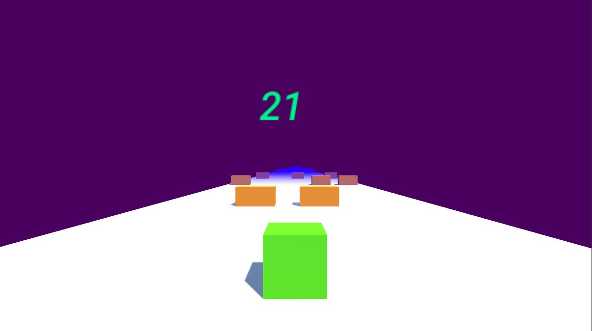

# crazecube-game
 >C#, Unity version: 2019.1.2f1
 
 Simple game created in Unity
 
 # Description
The game consists in avoiding the obstacle in the form of orange rectangles. The player is a green square which is controlled by buttons A(left) and D(right). There are 4 levels in the game.

# Visuals

#### Menu

#### Gameplay

